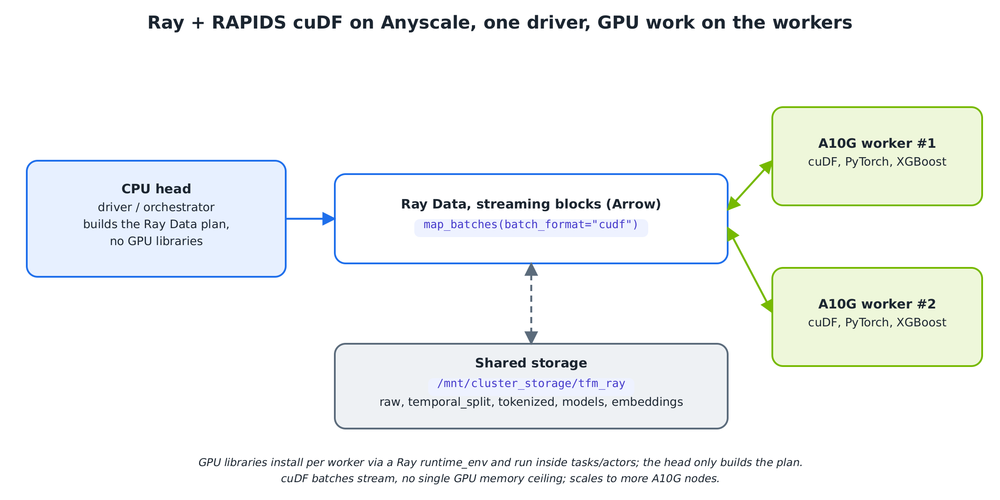

<h2> Build Your Own Transaction Foundation Model with Ray on Anyscale</h2>

This is based on NVIDIA's [**Build Your Own Transaction Foundation Model**](https://github.com/NVIDIA-AI-Blueprints/transaction-foundation-model)
developer example. It runs the same five-notebook pipeline and produces the same
results, with the single-node execution engine swapped for a distributed one:
**Ray Data** for streamed, out-of-core ingest, tokenization, and inference, and
**Ray Train** for distributed, fault-tolerant pretraining. NVIDIA **RAPIDS
cuDF/cuML** and the **HuggingFace** decoder are unchanged from the original; they
are now driven by Ray and run inside Ray tasks/actors on GPU workers.

Financial transaction data is one of the richest signals available in the enterprise. Every swipe, transfer, and payment encodes patterns of human behavior, from daily spending habits to subtle shifts that precede fraud. Traditional approaches rely on hand-crafted features and rules that are brittle, slow to adapt, and blind to the deep sequential structure in transaction histories. Foundation models change this equation: by pretraining on large volumes of unlabeled transaction sequences, they learn general-purpose representations of financial behavior that transfer to a wide range of downstream tasks: fraud detection, anomaly scoring, customer segmentation, and personalized financial services.

This developer example shows how to build such a model end-to-end, distributed across a GPU cluster with Ray:

- **Custom GPU-accelerated tokenizer on Ray Data**: The original modular, RAPIDS-powered tokenizer (`src/tokenizer/`) is streamed through Ray Data (`batch_format="cudf"`), converting heterogeneous tabular fields (merchant category, amount, time deltas, and more) into domain-specific token sequences across the cluster. The pipeline stays flexible: swap or add tokenizer components to match any transaction schema.
- **Distributed pretraining with Ray Train**: The same decoder-only foundation model is trained with causal language modeling, but the training loop runs under Ray Train's `TorchTrainer`. This gives cross-node data-parallel DDP, fault tolerance, checkpointing, and elastic scaling out of the box, from a single GPU to a multi-node cluster, while keeping a standard HuggingFace/PyTorch training step. The architecture is unchanged (Llama by default) and remains architecture-agnostic.
- **Embedding extraction and downstream evaluation**: Learned embeddings are extracted via last-token pooling in a pipelined Ray Data job (tokenize ‖ GPU infer) and evaluated on fraud detection with XGBoost, demonstrating clear lift over hand-crafted feature baselines.

**Blueprint architecture (NVIDIA):**


**Ray / Anyscale execution of the same pipeline:**



#### Software Components

##### Ray (Anyscale):

- **Ray Data**: Streamed, distributed, out-of-core data ingest, tokenization, and batch GPU inference
- **Ray Train**: Distributed, fault-tolerant pretraining (`TorchTrainer`, DDP) with checkpointing
- **Anyscale Workspace**: Managed Ray cluster with on-demand GPU autoscaling

##### NVIDIA RAPIDS:

- **NVIDIA RAPIDS (cuDF, cuML)**: GPU-accelerated data processing, tokenization, and UMAP

##### 3rd Party Software:

- **PyTorch 2.x**: Deep learning framework
- **HuggingFace Transformers**: Model definition, checkpointing, and loading
- **XGBoost**: Gradient-boosted trees for fraud detection
- **scikit-learn**: Classical ML preprocessing, metrics, and baseline utilities
- **pandas**: CPU dataframe operations and interoperability with GPU pipelines
- **NumPy**: Array operations used across preprocessing and inference
- **CuPy**: GPU array operations for tokenizer and embedding workflows
- **matplotlib**: Static visualizations
- **plotly**: Interactive 3D embedding visualization

## Table of Contents

- [Quickstart](#quickstart)
  - [Notebooks](#notebooks)
- [Deployment](#deployment)
  - [Prerequisites](#prerequisites)
  - [Create an Anyscale Workspace](#create-an-anyscale-workspace)
  - [Steps](#steps)
- [How It Works](#how-it-works)
- [Customization](#customization)
- [Model Architecture](#model-architecture)
- [Differences From the Original](#differences-from-the-original)

### Quickstart

#### Notebooks

| # | Notebook | Description |
|---|----------|-------------|
| 1 | `01_dataset_baseline_ray.ipynb` | Ingest the TabFormer financial transaction dataset with **Ray Data**, run cuDF feature engineering, create temporal train/val/test splits, and train a GPU-accelerated XGBoost baseline for fraud detection. |
| 2 | `02_seq_preproc_tokenization_ray.ipynb` | Stream the custom GPU-accelerated cuDF tokenizer through **Ray Data** to convert transaction records into domain-specific token sequences (Parquet). |
| 3 | `03_foundation_model_training_ray.ipynb` | Pretrain a decoder-only foundation model (~29M parameters) on tokenized sequences using **Ray Train** (`TorchTrainer`, cross-node DDP) with causal language modeling. |
| 4 | `04_inference_embedding_extraction_ray.ipynb` | Load the pretrained model, run pipelined **Ray Data** GPU inference, extract 512-dimensional embeddings via last-token pooling, and visualize with cuML UMAP (2D + interactive 3D). |
| 5 | `05_xgboost_fraud_detection_ray.ipynb` | Compare XGBoost fraud detection using raw features, foundation model embeddings, and combined features. |

1. Create an Anyscale Workspace with GPU workers (see [Create an Anyscale Workspace](#create-an-anyscale-workspace)).
2. From the wrapper workspace, create the editable Ray environment:
   ```bash
   scripts/setup_venv.sh
   source .venv/bin/activate
   ```
3. Open `01_dataset_baseline_ray.ipynb` and run it top to bottom, then continue through notebooks 02–05 sequentially. 

To run preprocessing without notebooks 01 and 02, use the script entry points
from the repo root:

```bash
tfm_repo/scripts/create_temporal_splits.py \
  tfm_repo/data/raw/parquet/card_transaction.v1.parquet \
  --overwrite
export TFM_SPLIT_DIR=$PWD/tfm_repo/data/temporal_split_v1
tfm_repo/scripts/tokenize_splits.py "$TFM_SPLIT_DIR" --overwrite
```

The first script writes the full temporal splits. The second script writes the
NB03 training inputs: `tokenized_v*/{train,val,test}`.

`tokenize_splits.py` defaults to the application-local `gpu-parquet` engine.
It uses Ray Core actors that read shared-POSIX Parquet row groups directly,
filter their assigned integral `User` range, and write idempotent output shards.
This avoids the materialization and groupby shuffle in the `legacy` Ray Data
path while keeping the dataset-specific I/O and commit contract in this
application. Pass `--engine legacy` to use the standard Ray Data pipeline.

### Deployment

#### Prerequisites

| Component | Requirement |
|-----------|-------------|
| Platform | [Anyscale](https://www.anyscale.com/) account (or any current Ray dev cluster with GPU nodes) |
| GPU | 2× NVIDIA A10G (or larger) GPU worker nodes; a GPU head node is recommended for the cuML UMAP step in NB04 |
| Ray | `3.0.0.dev0` from the local `../ray` checkout |
| Python | 3.10 for the local `.venv` setup |
| Image | A current Anyscale/Ray dev image matching the Ray checkout |
| CUDA | CUDA 12.x, matching the selected Ray/Anyscale image |

#### Create an Anyscale Workspace

Create an Anyscale Workspace with the configuration below, then open its IDE:

| Setting | Value |
|---------|-------|
| Ray image | A current Ray dev image that matches the local `../ray` checkout |
| Head node | `1xA10G` (NVIDIA A10G, 23 GB), gives the head a GPU for the NB04 cuML UMAP step |
| Worker group | `1xa10g-64cpu-256gb`, min 0 / max 2 (each a single-GPU A10G node → 2-way cross-node DDP in NB03) |
| Region | `us-west-2` |
| Autoscaling | Enabled, workers scale up on the first GPU op and scale back to 0 when idle |

Anyscale automatically provisions shared cluster storage at `/mnt/cluster_storage`, which the notebooks use to pass data between stages.

#### Steps

1. Open the workspace IDE and clone this repository (or upload it).
2. Install the head-node dependencies:
   ```bash
   scripts/setup_venv.sh
   source .venv/bin/activate
   ```
   GPU worker dependencies (torch, transformers, cuDF, CuPy, XGBoost) are installed
   automatically on each worker node via the Ray `runtime_env` declared in
   `src/ray_common.py`; you do not install them on the head.
3. Open and run each notebook one by one, in order (`01` → `05`), top to bottom, in the
   workspace IDE. Notebooks 02–05 are **idempotent**: a re-run skips any stage whose output
   already exists on shared storage; to force a fresh run of a stage, delete its directory
   under `/mnt/cluster_storage/tfm_ray/`.

**Data.** By default the notebooks generate a self-contained **synthetic** dataset
(`src/data_gen.py`) that reproduces the TabFormer schema, so the pipeline runs
anywhere with no download. To run on the real
[TabFormer](https://github.com/IBM/TabFormer) dataset, point the notebooks at the CSV:
```bash
export TFM_REAL_CSV=/path/to/card_transaction.v1.csv
```

### How It Works

The head node orchestrates Ray; **GPU code (cuDF, PyTorch, Transformers, XGBoost)
runs inside Ray tasks/actors on GPU workers** and returns plain Python. Worker
dependencies are declared once in a Ray `runtime_env` (`src/ray_common.py`) and
installed per node on first use. Data flows between notebooks through shared cluster
storage (`/mnt/cluster_storage/tfm_ray`):

- `JOB_RUNTIME_ENV` ships the `src` package to every node via `py_modules` (code only).
- `GPU_RUNTIME_ENV` / `TRAIN_JOB_ENV` install the GPU wheels (torch, transformers, cuDF, …) on worker nodes.

GPU library code is loaded lazily inside the Ray actors so the modules stay
importable on a CPU head. The one head-side GPU step is NB04's cuML UMAP
visualization.

### Customization

The example is designed for extensibility:

- **Tokenizer**: The modular tokenizer pipeline (`src/tokenizer/`, unchanged from the original) can be adapted to different transaction schemas by adding or replacing individual tokenizer components. The Ray Data wrapper is in `src/ray_tokenize.py`.
- **Model Architecture**: The decoder configuration lives in `src/ray_common.py` (`MODEL_CONFIG`). Swap in any HuggingFace-compatible decoder architecture by editing it.
- **Training scale**: In `03_foundation_model_training_ray.ipynb`, change `NUM_WORKERS` to scale the DDP world size across more GPUs/nodes and `MAX_STEPS` for the training budget. Ray Train handles the distribution.
- **Cluster scale**: Raise the worker group's max replicas to ingest, tokenize, and train over more data without code changes.
- **Downstream Tasks**: Replace XGBoost with any classifier that accepts fixed-length feature vectors.

### Model Architecture

The included example uses a Llama decoder architecture, but any HuggingFace-compatible
decoder model works. The configuration is defined in `src/ray_common.py`.

| Parameter | Value |
|-----------|-------|
| Architecture | Llama (decoder-only transformer) |
| Parameters | ~29M |
| Hidden size | 512 |
| Layers | 8 |
| Attention | Grouped Query Attention (8 query heads, 2 KV heads) |
| Context window | 8,192 tokens (RoPE) |
| Activation | SwiGLU |
| Normalization | RMSNorm |
| Vocabulary | ~6,251 domain-specific tokens |

### Differences From the Original

| Stage | Original (NVIDIA) | With Ray (Anyscale) |
|-------|-------------------|------------------|
| Ingest / feature engineering | pandas + cuDF on one node | **Ray Data** streamed read + cuDF `map_batches` |
| Tokenization | cuDF on one node | same cuDF tokenizer, streamed via **Ray Data** (`batch_format="cudf"`) |
| Pretraining | NeMo AutoModel, single node | **Ray Train** `TorchTrainer`, cross-node DDP, fault tolerance, checkpointing |
| Embedding extraction | head-side loop | pipelined **Ray Data** GPU inference |
| Checkpoint | downloaded pretrained checkpoint | produced by notebook 03 to shared storage |
| Dependencies | installed in a container | head deps in `requirements.txt`; GPU worker deps via Ray `runtime_env` |
